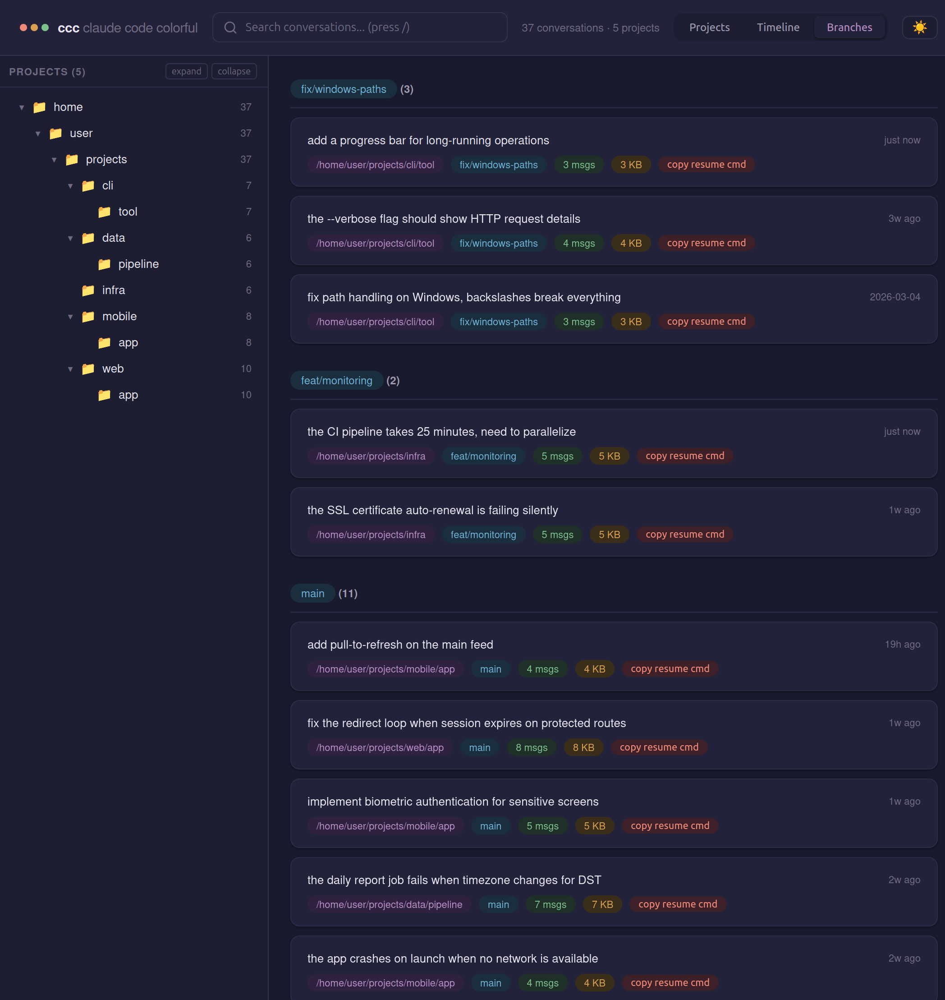
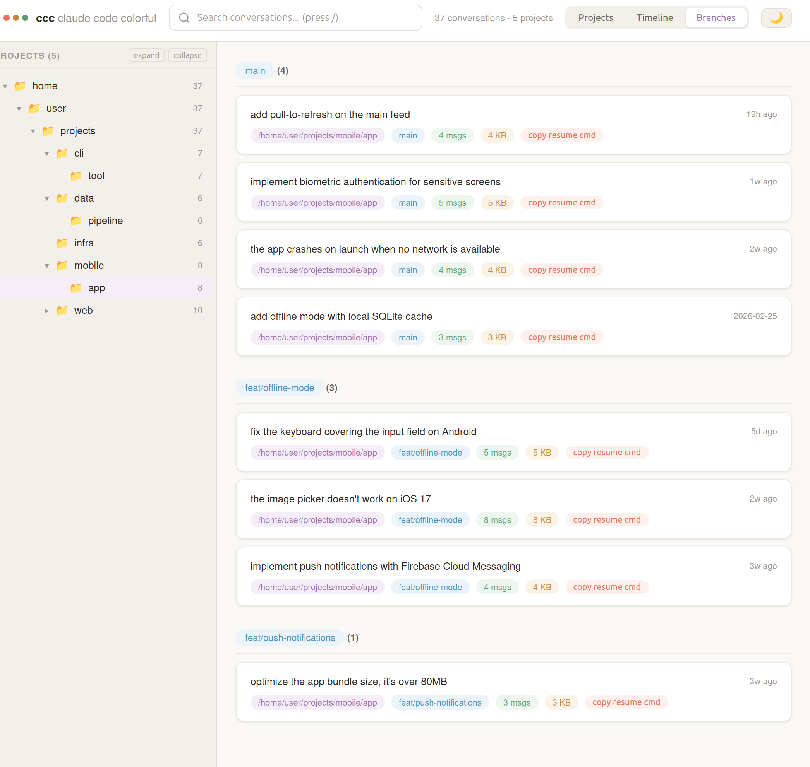
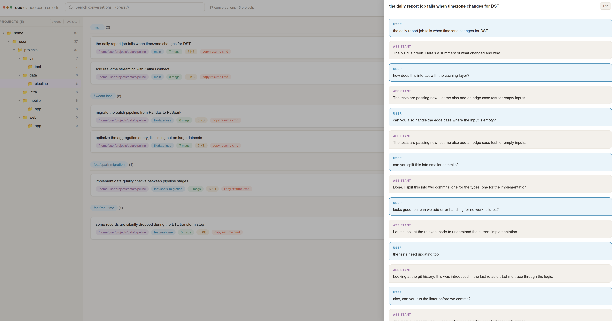

# ccc — claude code colorful

A colorful conversation history browser for [Claude Code](https://docs.anthropic.com/en/docs/claude-code). Zero dependencies. Just Python 3.10+ and a browser.



## Why

Claude Code's built-in `/resume` is functional but plain. `ccc` gives you a colorful, searchable dashboard to browse your conversation history — grouped by project, branch, or timeline.

- **Zero dependencies** — just Python stdlib, no npm/cargo/pip install
- **Single file** — one script, generates one self-contained HTML file
- **Private** — reads `~/.claude/` locally, nothing leaves your machine
- **Colorful** — light and dark themes with warm color palette

## Install

```bash
# Copy the script somewhere in your PATH
curl -o ~/.local/bin/ccc https://raw.githubusercontent.com/tham-le/ccc/main/ccc
chmod +x ~/.local/bin/ccc
```

Or clone and symlink:

```bash
git clone git@github.com:tham-le/ccc.git
ln -s $(pwd)/ccc/ccc ~/.local/bin/ccc
```

## Usage

```bash
ccc                  # open dashboard for current directory
ccc --all            # show all projects
ccc --serve          # live server on localhost:8080
ccc --serve 3000     # custom port
ccc -o file.html     # save to specific path
```

Run `ccc` inside a project folder and it filters to that project's conversations. Use `--all` to see everything.

> **Note:** Some browsers block `file://` access to hidden paths (`~/.cache`, `~/.local`). By default `ccc` writes to `~/Documents/ccc/index.html` which works everywhere. If your browser still blocks it, use `ccc --serve` instead — it serves over `http://localhost` which browsers always allow.

## Features

**Three views** — switch between Projects, Timeline, and Branches



**Conversation viewer** — click any card to read the full conversation



**Tree sidebar** — collapsible folder hierarchy with expand/collapse all

**Search** — filter by message content, git branch, or project path. Press `/` to focus, `Esc` to clear.

**Keyboard navigation** — `j`/`k` to move through cards, `Enter` to open, `Esc` to close

**Dark/light theme** — toggle with the button, persists across sessions

**Copy resume command** — one click to copy `claude --resume <id>` to clipboard

**Serve mode** — `ccc --serve` starts a local server that regenerates on each page load. No file watcher needed.

## How it works

Claude Code stores conversations in `~/.claude/projects/` as JSONL files. `ccc` reads those files, extracts metadata (timestamps, git branch, message count, first message), and generates a self-contained HTML page with all the data embedded as JSON. Everything runs client-side — no server needed for the default mode.

## License

MIT
